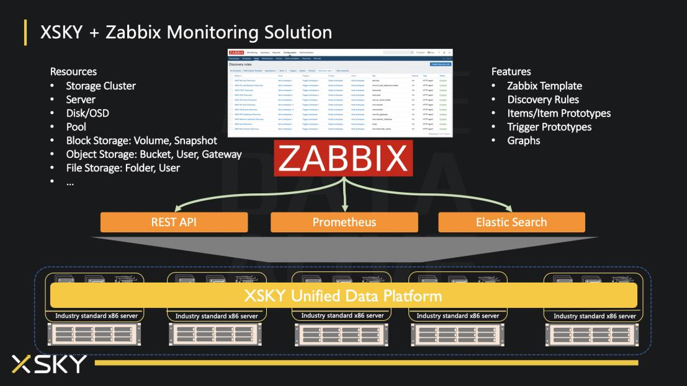

# Zabbix Template for XSKY SDS

The Zabbix Template includes discovery rules, item prototypes, trigger prototypes and graphs, Zabbix will periodically gather resource metrics from HTTP/HTTPS REST API, convert metrics into JSON object, automatically create resource metrics by discovery rules, and send triggers based on the trigger rules.

## Architecture

## Requirements

* XSKY SDS >= v4.0
* Zabbix >= v4.2

## Set Host Macros

Please set host macros after linking template to a host.
